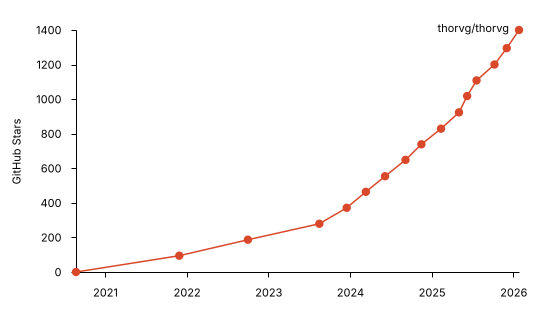

")

# Overview

After one and a half years of continuous development, ThorVG reaches a major milestone with version 1.0, marking a generational leap from v0 to v1. This is not just an update — it's **a rebuilt foundation for high-performance, scalable, and portable 2D vector graphics** across platforms and devices. Throughout its development, ThorVG has evolved into a mature, production-ready graphics engine, demonstrating proven quality and performance in real-world applications.


In the meanwhile, **ThorVG has gained rapid adoption and growing community interest**, reflecting its evolution from an early-stage project into a widely recognized and practically adopted vector graphics engine — ready for real-world, cross-platform use.



It has already been successfully integrated into several commercial and embedded products — most notably as the Vector Canvas engine behind the **Artboard output in** [LottieCreator](https://creator.lottiefiles.com/), and as a vector rendering backend for IoT platforms from companies like [Espressif](https://www.espressif.com/). These real-world integrations highlight ThorVG’s suitability for resource-constrained environments, reinforcing its value as a lightweight, scalable, and high-performance vector solution for both embedded and cross-platform use.


# What’s New in v1.0?

ThorVG v1.0 marks a major step forward since v0.15. This release brings **comprehensive improvements** across the engine — from rendering backends to visual fidelity and usability — making it more powerful, expressive, and production-ready than previous version.

- Advanced **text rendering**, rich **visual effects**, and precise **blending** support for enhanced graphical expression
- Expanded **Lottie animation capabilities** for cross-platform playback, including modular **Web Player presets** optimized for size, performance, and rendering mode (CPU/GPU)
- Significant **performance improvements**, across CPU-/GPU-bound and embedded environments
- A new era of **Web integration** with **WebGL**, **WebGPU**, and the lightweight **WebCanvas** for seamless browser rendering
- A more precise, elegant, and **developer-friendly API** design for real-world application needs
- Official **Swift integration** and supplement with **a plenty of examples** and a tutorial for easy and fast onboarding.
- Numerous bug fixes and **improved stability for production use**.

## Migration Notice

As part of the v1.0 transition, several core components have been refactored and unified, resulting **in changes to the library structure and usage patterns**. This includes the integration of previously separate modules, a streamlined API, and updated workflows for initialization and rendering.

> We recommend developers to carefully review this release note and consult the latest documentation and examples before upgrading existing projects or starting new ones with v1.0. See the **F.1 API Changes** for details.

Find the v1.0.0 release on [GitHub](https://github.com/thorvg/thorvg/releases/tag/v1.0.0).

# Major Enhancements

## Richer Text

ThorVG v1.0 introduces more powerful and flexible text rendering capabilities, offering richer typographic control and enhanced visual consistency across platforms. These enhancements make ThorVG’s text engine better suited for UI components, animations, and dynamic layouts where precise and adaptable typography is essential.

The following is a list of new text features introduced in ThorVG v1.0:

### Text Layout & Alignment

Support for horizontal and vertical alignment, allowing precise control over text positioning in various UI contexts.

```cpp
// Sets the virtual layout box (constraints) for the text
text->layout(w, h);
// Horizontal, Vertical alignment/anchor in [0..1]
text->align(0.5f, 0.0f);
```


### Text Line Wrapping

Added automatic line breaking with selectable modes - **character-based**, **word-based**, **smart wrapping**, and **ellipsis truncation** for overflow handling.

```cpp
// Wrap at the word level
text->wrap(TextWrap::Word);
```


### Text Line Breaking & Character Spacing

ThorVG v1.0 adds support for **manual line breaking**, allowing developers to explicitly control line breaks using newline characters such as \\n. This enables precise formatting of multi-line text blocks, especially in dynamic layouts or text-driven animations.

Additionally, customizable **character spacing** is now supported, allowing for fine-tuned adjustments to improve legibility or achieve specific typographic styles.

```cpp
// The scale factor for letter and line spacing
text->spacing(1.5f, 1.5f);
```


### Text Outlines

Support for **outlined text**, enabling stylistic effects and improved contrast in diverse backgrounds.

```cpp
// Set the text outline width and color [R, G, B]
text->outline(3, 255, 200, 200);
```


## Blendings

ThorVG v1.0 introduces a more comprehensive and consistent blend mode system, significantly improving the behavior of blending modes and aligning both formulas and composition logic with industry-standard models, such as those defined in Lottie, SVG, and the W3C Compositing and Blending specification. These improvements ensure greater visual consistency and cross-platform compatibility, particularly in web and animation workflows.

